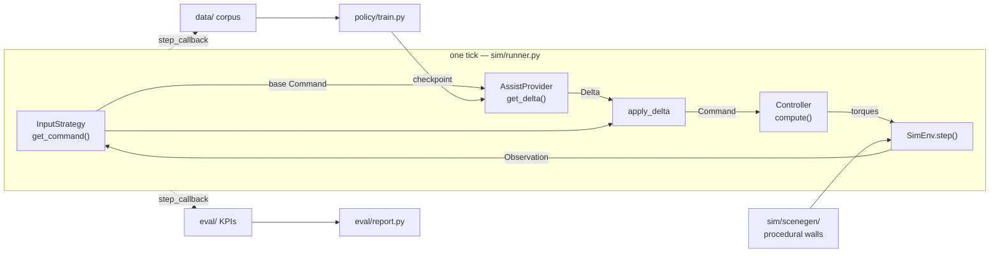

# Architecture tour

A guided walk through `src/ai_teleop/`, in the order the data flows. It is for
someone who has read the [README](../README.md) and now wants to know *how the pieces
fit* — which module owns which idea, and why the seams sit where they do.

**This is not an API reference.** The docstrings are, and they are good: every module
opens with a paragraph explaining its job, and the non-obvious constants carry the
experiment that set them. Read this to know *which* file to open; read the file to
know what it does.

Companion documents:

- [`docs/cli.md`](./cli.md) — every command and flag.
- [`docs/design/`](./design/) — the *why* behind each subsystem (problem structure,
  teleop input, expert corrections, policy model, evaluation protocol).
- [`docs/data-schema.md`](./data-schema.md) — the on-disk corpus contract.
- [`docs/phase-1-results.md`](./phase-1-results.md) — measured outcomes.
  **The Phase-1 headline number is under revision** (a 2026-07-22 reproduction attempt
  did not reproduce it); this tour deliberately makes no performance claims.

---

## The shape of it, in one paragraph

A human moves their hand; that becomes a coarse 6-DoF **base command**. A correction
layer — nothing, an analytical expert, or a trained policy — returns a small **delta**
that is added on top. The sum goes to an always-on impedance **controller**, which
emits joint torques, and MuJoCo steps. That loop runs at 500 Hz and lives in exactly
one function. Everything else in the repo either *feeds* that loop (scene generation,
input strategies), *records* it (the corpus), *learns from the recording* (the policy),
or *measures* it (the eval harness).



The dashed arrows are the same hook. `step_callback` is the loop's only extension
point, and it is how three unrelated subsystems attach without the loop knowing they
exist.

---

## 0. Vocabulary — `common/` and `domain/`

Four small types carry everything, so meet them first.

| Module | What it defines |
|---|---|
| `common/observation.py` | `Observation` — one tick of world state, shared by `SimEnv`, controllers, expert and policy. Carries both non-privileged sensors and the privileged true poses; who is allowed to read what is a convention enforced by review, not by the type. |
| `common/command.py` | `Command` — the EE-pose setpoint a `Controller` consumes each tick. This is the operator's intent, not the robot's state. |
| `domain/delta.py` | `Delta` — the correction added on top of a `Command`, plus `apply_delta` (the composition rule, including the left-multiply convention for the rotation channel), `clamp_delta` (the hard safety bound), and `NoAssist` (the identity provider). |
| `domain/interfaces.py` | The two Protocols the whole system is built around — 29 lines, and the most load-bearing file in the repo. |

```python
class InputStrategy(Protocol):
    def get_command(self, observation: Observation) -> Command: ...

class AssistProvider(Protocol):
    def get_delta(self, observation: Observation, command: Command) -> Delta: ...
```

**This is the project's thesis in two signatures.** `NoAssist`, the analytical expert
and the trained policy are all `AssistProvider`s, so swapping them is a one-argument
change to the runner — no edit to the controller, the input, or the loop. The code
audit records this as a deliberate keep (finding B-3): a Protocol with two
implementations is usually a smell, but here the seam *is* the contribution and the
swap is exercised for real by the ablation.

`domain/` imports nothing else from the package, and `common/` imports nothing from
`sim/`. That is checked, not hoped: it is what makes the swap actually work.

The rest of `common/` is genuine shared plumbing:

| Module | Why it exists |
|---|---|
| `common/geometry.py` | The one rotation toolbox — `mat3_to_quat`, `quat_mul`, `quat_conjugate`, `quat_to_matrix`, `axis_from_quat`, `quat_to_6d`. Thin MuJoCo wrappers, one import path (they used to be split across two modules; audit finding D-1 merged them). |
| `common/seating.py` | `SeatingGeometry` — the single definition of *how seated the peg is* (penetration depth, lateral error). Data generation and the eval harness both build on it. **Caveat**, from audit finding H-4: they share this *geometry* but not the *decision rule* layered on top — data-gen scores success on the first seated step, eval requires it sustained. Two success rates from the two paths are not the same metric. |
| `common/log.py` | Console + file logging, and the shared `--log-level` argparse wiring. Ordinary infrastructure. |

---

## 1. Where the operator's command comes from — `input/`

An `InputStrategy` per command source, picked at runtime by
`kvn episode --input {scripted,vision}`.

| Module | Role |
|---|---|
| `input/scripted_noisy_human.py` | `ScriptedNoisyHuman` — the deterministic, seedable "realistic operator". Structured noise (tremor, overshoot, mis-aim), not white noise. **This is the default and the one that matters**: it is what makes data generation reproducible and the paired ablation statistically powerful, because it is *open-loop* — its command stream depends only on its seed and tick, never on what the robot actually did. Two runs of the same seed therefore differ only in the assist layer. |
| `input/hand_tracker.py` | `StereoHandSource` — the sensor half of live teleop. Wraps the standalone [stereohand](https://github.com/NavehBrenner/stereohand) package: two webcams → metric 3-D hand landmarks → a `HandReading`. |
| `input/vision_input.py` | `VisionInput` — the strategy half. Turns `HandReading`s into a base `Command`: workspace calibration, the neutral anchor and re-anchoring (lift your hand out of frame), and the fist-to-grip mapping. |

The split is deliberate: `hand_tracker` knows about cameras and never about the robot;
`vision_input` knows about the robot and never about MediaPipe.

A keyboard strategy was scoped in M8 and dropped — `scripted` covers repeatable
benchmarking and `vision` covers the live demo, and nothing else asked for it.

---

## 2. The world — `sim/` and `sim/scenegen/`

### The runtime environment

| Module | Role |
|---|---|
| `sim/scene.py` | `SimEnv` — a thin object wrapper over a MuJoCo model/data pair. `reset`, `step`, `get_observation`, `sync_viewer`, wrist-camera rendering. The one place raw `mujoco` calls live. |
| `sim/config.py` | `EnvConfig` — the metadata that defines one concrete task environment, plus `episode_wall_seed`, the derivation from `(master_seed, episode_index)` to the wall seed. Data generation and eval both use it, which is what makes a trial's scene reproducible from two integers. |
| `sim/scene_source.py` | Resolves *which* scene XML to load — a committed asset, or a freshly generated wall. |
| `sim/env_setup.py` | `make_env` / `make_wall_task_env` — the bridge from the offline wall generator to a runnable `SimEnv`. The seam between "generate a wall" (slow, CAD, offline) and "run an episode" (fast, per-episode). |

### The wall generator

`sim/scenegen/` is the largest subpackage in the repo and the one most likely to
surprise a reader: it is an **offline CAD pipeline**, not simulation code. Given a
sparse request (or just a seed) it produces a drop-in MJCF wall with a chamfered hole,
its meshes, and a provenance header. Heavy CadQuery imports are lazy, so the sim
runtime can import the dataclasses without dragging in CAD.

The pipeline, in order:

| Module | Step |
|---|---|
| `scenegen/config.py` | The vocabulary: `HoleSpec`, `WallSpec`, `WallScene`, and `SamplingRanges` — the distribution a random wall is drawn from. Several of its constants embed the sweep that chose them (the chamfer range carries LAB-77 in a comment). |
| `scenegen/sampler.py` | `sample_wall_spec` — resolve a sparse, possibly-partial request into a fully concrete `WallSpec`. Pure, numpy-only, no I/O. |
| `scenegen/shapes2d.py` | The hole outline in the wall-face plane (y, z) — rings and the outer boundary. |
| `scenegen/partition2d.py` | `convex_pieces` — convex partition of the face (a rectangle minus the hole rims). MuJoCo collides convex geoms only, so this is not optional. |
| `scenegen/solid.py` | Builds the actual parametric solid in CadQuery and tessellates it to metre-scale triangle meshes — the *visual* geometry. |
| `scenegen/decompose.py` | Derives the *collision* geometry analytically (prism extrude + chamfer wedges) rather than running a voxel convex decomposer. Cheaper and exact for this shape family. |
| `scenegen/emit.py` | Writes the OBJ meshes and builds the MJCF XML. |
| `scenegen/meta.py` | Writes `header.json` — the provenance record for a generated wall. |
| `scenegen/compose.py` | Composes a runnable scene (robot + wall + peg) around the generated wall. |
| `scenegen/generate.py` | `generate_wall` / `generate_from_spec` — the end-to-end entry points that drive all of the above to on-disk artifacts. |

The visual/collision split (`solid.py` vs `decompose.py`) is the non-obvious part: the
same wall is described twice, on purpose, because what looks right and what collides
correctly have different requirements.

One historical note, from audit finding B-1: the config declares five hole shapes and
exactly one — `circle` — is implemented, with four `NotImplementedError` sites
supporting shapes nobody asked for in a project whose task is a round peg. The audit's
verdict is DELETE; expect that to shrink.

---

## 3. The controller — `control/`

Always on, mode-less, and identical in every configuration under test. That is the
point: if the backbone changed between arms, the ablation would be comparing two
robots.

| Module | Role |
|---|---|
| `control/backbone.py` | `Controller` — the M2 backbone. Takes an `Observation` + a `Command`, emits joint torques. Knows nothing about deltas, assistance, trials, or success. |
| `control/impedance.py` | `impedance_torque` — the direction-dependent Cartesian impedance law. Stiff laterally, compliant axially, so the peg can slide into a hole it is not perfectly aligned with. The MuJoCo footguns are documented at the call site (`mju_subQuat` returns a *body-frame* axis-angle, so no transpose — the kind of comment that prevents a wrong "fix"). |
| `control/lock.py` | The lock state machine and force-cap watchdog — `LockState`, `LockStatus`, `LockController`. The safety layer that halts a run driving into the wall. |

---

## 4. The loop — `sim/runner.py`

`run_episode(environment, controller, input_strategy, assist, *, max_steps, ...)`.

**The single per-tick composition lives here and nowhere else:**

```
InputStrategy → base Command → AssistProvider → apply_delta
    → Controller.compute → SimEnv.step
```

It is deliberately free of console and logging side effects, so every caller can wrap
it. It is always physics-rate — exactly one command, one controller recompute and one
`mj_step` per iteration — which is what lets a replay reproduce a recording
tick-for-tick.

Its one extension point is `step_callback`:

```python
StepCallback = Callable[[int, Observation, Command, Delta, Command], bool]
```

Called each tick with the *pre-step* observation the assist acted on; returning truthy
ends the episode. Data generation, the eval harness and DAgger all hang off it. It was
the one untyped contract in `src/` until audit finding H-2 named the alias.

Two constants worth knowing about, because they have already caused a bug: the *task*
budget (`data.generate.DEFAULT_MAX_STEPS`, 9000) and the *live/interactive* budget
(`runner.DEFAULT_LIVE_MAX_STEPS`, 5000) are different numbers and used to share a name.
Eval once scored at 5000 against a corpus generated at 9000, making cross-path numbers
incomparable (LAB-107, audit finding H-3). The rename is the fix; the comment at
`runner.py:48` is the memorial.

---

## 5. The corpus — `data/` (and the teacher, `expert/`)

### The teacher

`expert/expert.py` — `Expert`, a closed-form, geometry-driven `AssistProvider`. It
reads the **privileged** true peg and hole poses out of the `Observation` and returns a
clamped Δ with the *same signature* the learned policy will have. It is allowed to
cheat; the policy will have to reproduce its output from non-privileged streams alone.

Its per-step law is align-then-advance: split the tip→hole error into axial and lateral
components, correct laterally, rotate the peg axis onto the bore axis, and only advance
along the bore once both are within tolerance. Everything is multiplied by a smooth
distance gate that is **zero by construction** far from the hole — matching what the
deployed policy can possibly support, since in free space its F/T reading is ≈0 and
Phase 1 has no exteroception. Full derivation in
[`docs/design/expert-corrections.md`](./design/expert-corrections.md).

### Generating the corpus

`data/generate.py` is the M4 pipeline — core functionality, with
`scripts/generate_dataset.py` as its thin argparse front door. (That front-door pattern
is the repo's convention; training briefly broke it, see §6.) It runs N unattended
episodes — fresh procedural wall → noisy human → expert → controller → sim — and writes
one folder per episode. Failures are kept: diverse state coverage helps behavioral
cloning.

It also runs each episode a second time with the expert replaced by `NoAssist`, on the
*same scene and the same command stream*, to record what the noisy human would have
achieved alone. That paired baseline is what makes the expert's lift measurable rather
than asserted.

The corpus is fingerprinted by its generation config, so a regenerated dataset can be
checked against its manifest. Two caveats a reader should carry (audit findings C-1a
and H-9): three termination thresholds are deliberately *not* in the fingerprint (they
cannot be added without invalidating committed history), and the fingerprint certifies
*same knobs*, not *same data* — the repo contains `dataset_9` and `dataset_10`, two
directories with an identical hash and 35 differing trajectories, as a worked
counter-example.

| Module | Role |
|---|---|
| `data/generate.py` | `GenerationConfig`, `generate_dataset`, `regenerate_from_metadata` — the pipeline and the frozen config the fingerprint derives from. |
| `data/step_callbacks.py` | `EpisodeLogger` (records the trajectory through the runner's hook) and `TerminationProbe` / `episode_terminal_reason` — the episode-outcome policy: depth → success, force cap → abort, timeout → failure. |
| `data/trajectory.py` | The per-episode writer/reader (`EpisodeRecorder`, `load_episode`) and the on-disk path conventions. The stable contract M5 trains against. |
| `data/schema.py` | The `TypedDict`s that *define* that contract — `EpisodeMetadata`, `EpisodeSummary`, `DatasetConfig`, `ResBCDatasetMetadata`. [`docs/data-schema.md`](./data-schema.md) describes the format; this module is the format. |
| `data/images.py` | Wrist-camera frame loading — the load-side counterpart to `EpisodeLogger`'s render side. Only populated for the vision (Phase 2) corpora. |
| `data/dataset.py` | The training-side loader: `extract_training_episode` (trajectory → the three input streams), normalization stats, episode splits, padding-aware collation, `build_dataloaders`. |

`data/dataset.py` deserves a note. `extract_training_episode` (batch, `(T, …)`) and
`LearnedResidual._assemble_streams` (single step, deployment) build the same input
vectors independently — a textbook silent-covariate-shift trap. It is handled the right
way: a test asserts the two are *equal* rather than hoping, and both sites cross-
reference each other in comments. The duplication is intrinsic (batch vs O(1) per tick);
the equality is not assumed (audit finding D-2).

---

## 6. The student — `policy/`

The only package that imports `torch`; the rest of `ai_teleop` stays torch-free.

Architecture, locked in [`docs/design/policy-model.md`](./design/policy-model.md): a
**single stateful GRU over an early-fused observation**. Each control step, the command,
F/T and proprioception streams contribute their current normalized value, concatenated
into one vector, fed to one GRU carrying hidden state across the episode. An MLP head
maps hidden state to the 7-D correction. Phase 2 only *widens* the fused input with an
image embedding — core and head unchanged.

| Module | Role |
|---|---|
| `policy/config.py` | `PolicyConfig` (architecture — serialized into every checkpoint, which is why every field is defaulted so old checkpoints still load) and `TrainConfig` (optimization). |
| `policy/model.py` | `ResidualPolicy` — the network. A batched sequence `forward` for training and an O(1) per-tick `step` for deployment, from the same weights. |
| `policy/image_encoder.py` | `ImageEncoder` — the Phase-2 wrist-image CNN whose embedding widens the fused input. |
| `policy/losses.py` | `residual_bc_loss` — **per-channel weighted**, because Δposition (m), Δorientation (rad) and Δgrip (N) are in different units and matter differently. The orientation channel uses a true geodesic distance on SO(3), not a component-wise difference on the axis-angle — the naive version is wrong near the ±π wrap. All reductions are masked, since batches are zero-padded to the longest episode. Also home to the action-rate penalty. |
| `policy/train.py` | The pipeline. `train()` is the loop over prebuilt loaders (Adam, plateau LR schedule, TBPTT over the stateful GRU, early stopping, best-weight restore) — it takes loaders so it can be tested on synthetic data with no corpus on disk. `train_policy()` is the whole thing: corpus in, run folder out, returning a `TrainedRun` that carries the checkpoint path. |
| `policy/run_artifacts.py` | Makes every run self-documenting: `checkpoint.pt` + `metadata.json` (hyperparameters, dataset stats, git commit) + `history.{json,png}`. |
| `policy/residual_policy.py` | `LearnedResidual` — a trained checkpoint wrapped as an `AssistProvider`. This is where the student rejoins the seam and becomes swappable with `NoAssist` and the expert. It reads `use_vision` off the checkpoint and selects the image branch itself, so a checkpoint is self-describing. |

`policy/train.py` is worth pausing on for a reason unrelated to training. Until recently
the pipeline lived in `scripts/train_policy.py`, and because `scripts/` is not an
importable package, `dagger.py` had to *shell out* to it — a 14-element stringly-typed
argv, failures arriving as an exit code, and the checkpoint path reconstructed by naming
convention. Moving the pipeline into the package (audit finding G-1) made the subprocess
disappear on its own. It is the clearest example in the repo of *where code lives*
being a design decision with real costs.

---

## 7. Measurement — `eval/`

A **passive observer**. It watches the runtime `Observation` stream and has no
dependency on the controller in either direction: trial, success and KPI concepts live
only here, so the controller stays mode-less. `eval/` never imports a concrete policy —
configs arrive as `(label, assist_factory)` pairs from the caller.

| Module | Role |
|---|---|
| `eval/observer.py` | `TrialObserver` — a `step_callback` that computes the KPIs live and ends the trial on sustained seating or a force abort. Its force cap and sustain requirement differ from data-gen's on purpose; see audit finding H-4 before comparing rates across the two paths. |
| `eval/schema.py` | `TrialKPIs` / `TrialOutcome` — the behavior-free per-trial record. The contract between running trials and reporting on them. |
| `eval/trace.py` | `EvalTraceRecorder` + `replay_trace` — persist the realized state stream so KPIs can be recomputed offline without re-running the sim. |
| `eval/ablation.py` | The paired-seed mechanism. One *trial* is a fixed `(master_seed, episode_index)`, which pins both the wall and the operator; running that same trial once per config changes **only the assist layer**. Zero operator variance between arms is where the statistical power comes from. |
| `eval/report.py` | Aggregation, tables and plots: marginal summaries, seed-paired comparison, exact-binomial McNemar on the discordant split, Wilcoxon signed-rank on the continuous KPIs. |

The audit read `report.py` line-by-line for correctness and cleared its statistics
(exact binomial rather than the χ² approximation, Wilcoxon guarded against the
all-zero-difference case, unmatched seeds dropped rather than zero-filled). What it
found instead was a *presentation* gap — per-KPI sample sizes are computed and not
rendered, so a success-only KPI can print a p-value over four pairs under a footer
saying thirty (finding H-1). If you are reading a table from this tool, check the n.

---

## 8. Closing the loop — `dagger.py`

The one module at the package root, because it is not a layer — it is a procedure that
drives all of them.

Behavioral cloning has a **covariate-shift** gap: the clone drifts into states the
expert never demonstrated, and its corrections there are confidently wrong. DAgger is
the standard fix — let the policy act, so it visits its own drift states, and query the
expert for the correct label *at those states*.

It owns the new mechanism only, and reuses everything else:

- **Rollout + relabel** (`rollout_and_relabel`) drives the shared `run_episode` with the
  learned policy as the acting `assist` and the `Expert` as the *label provider* on
  `EpisodeLogger`. Every visited state is recorded with the expert's correction as its
  BC target.
- **Aggregation** (`seed_aggregate`, `append_summaries`) grows a dataset directory whose
  manifest unions the seed corpus (symlinked, not copied) with each round's relabeled
  episodes — in the exact on-disk schema `data/dataset.py` already loads.
- **Retrain** (`run_dagger`) calls `train_policy` and the eval path unchanged.

Rollouts use a **distinct wall family** from both the training corpus and the held-out
eval walls, so the eval walls stay clean and each round adds wall diversity on top of
the on-policy states.

`scripts/dagger.py` is its front door — note it is *not* on the `kvn` CLI, so it runs as
`python scripts/dagger.py`.

---

## 9. The front doors — `cli.py` and `scripts/`

`cli.py` is a thin dispatcher, not a reimplementation. App commands run the matching
script under `scripts/` with the current interpreter; each script keeps its own argparse,
so `kvn <command> --help` shows that script's real flags. Dev-gate commands delegate to
the poe tasks in `pyproject.toml`, so the gate has one source of truth.

| `kvn` command | Script | Runs |
|---|---|---|
| `sim` | `view_generated_wall.py` | Generate and view a procedural wall |
| `smoke` | `smoke_test_sim.py` | M1 scene smoke test |
| `episode` | `run_episode.py` | One end-to-end episode through the seam |
| `harness` | `dev_harness_controller.py` | M2 controller tuning harness |
| `gen` | `generate_dataset.py` | Generate the BC corpus |
| `train` | `train_policy.py` | Train the residual, write a checkpoint |
| `evaluate` | `evaluate.py` | Paired ablation + difficulty sweep |
| — | `report_results.py` | Build the KPI report from committed trial records |
| — | `dagger.py` | The DAgger loop |
| `fmt` `lint` `typecheck` `test` `check` | *(poe)* | The dev gate |

`scripts/dev/` is a separate world: one-off lab probes and instruments. Their
conclusions live in the project wiki, not in the scripts, and most of the pool is
slated for deletion (audit finding F).

---

## Reading paths

**"How does one episode actually run?"**
`sim/runner.py` → `domain/interfaces.py` → `control/backbone.py`. Three files, ~500
lines, and you have the whole control path.

**"How was the policy trained?"**
`data/generate.py` (corpus) → `data/dataset.py` (loading) → `policy/train.py` (loop) →
`policy/residual_policy.py` (deployment). Then
[`docs/design/policy-model.md`](./design/policy-model.md) for why the architecture is
what it is.

**"Where do the numbers come from?"**
`eval/ablation.py` (what a trial is) → `eval/observer.py` (what success means) →
`eval/report.py` (the statistics). Then
[`docs/design/evaluation-protocol.md`](./design/evaluation-protocol.md), and
[`docs/review/code-audit.md`](./review/code-audit.md) §H before quoting anything.

**"What is the actual contribution?"**
`domain/interfaces.py`, then `expert/expert.py` and `policy/residual_policy.py` side by
side — the same two-method interface, one solved analytically with privileged
information, one learned from it without.

---

## Coverage note

Every module under `src/ai_teleop/` is named above except the package `__init__.py`
files, which are re-export surfaces and package docstrings rather than implementation
— read them for the package-level orientation, which is genuinely good, but there is no
logic in them to explain. `scripts/dev/` is described as a pool rather than
file-by-file, deliberately: it is scaffolding whose findings are already durable
elsewhere.
