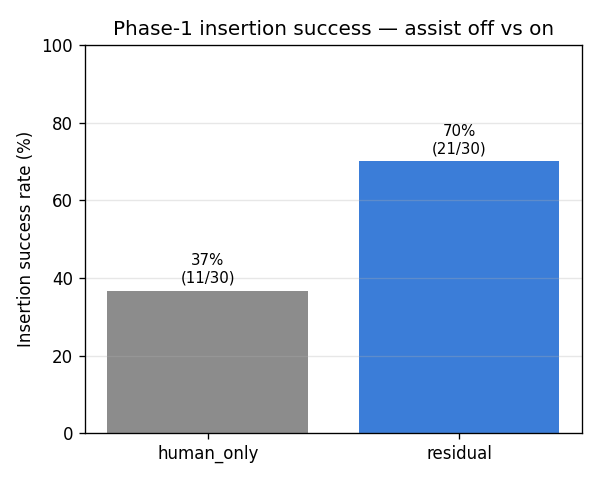
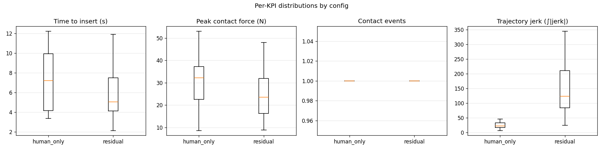
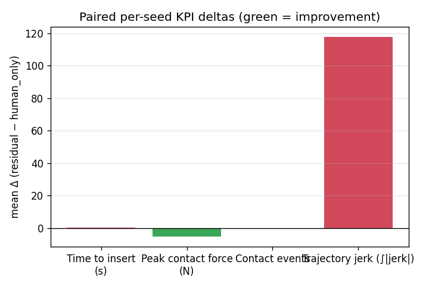

# Phase-1 Results — F/T Residual vs Human-Only (LAB-38 / M6)

The first publishable result and the close of **Phase 1**: a reproducible, paired-seed
KPI comparison of the F/T-only residual policy against the unassisted human-only baseline,
on the same task under matched operator conditions. This is the artifact the **D1 Design
Review** repackages.

> ## ⚠️ This result did not reproduce — investigation closed (LAB-114, 2026-07-23)
>
> Scaling this run to 100 paired seeds — the "final D1 figure" the status note below
> promised — **failed to reproduce the headline.** Two independently retrained residuals
> both measured **no significant lift**:
>
> | Run | `human_only` | `residual` | Δ (paired, 100 seeds) | p |
> |---|---|---|---|---|
> | published (below) | 36.7% | **70.0%** | **+33.3 pp** | 0.006 |
> | retrain, no action-rate penalty | 50.0% | 46.0% | **−4.0 pp** | 0.557 |
> | retrain, action-rate penalty 100 | 50.0% | 41.0% | **−9.0 pp** | 0.136 |
>
> Records: `results/phase-1/repro_2026-07-22_{ar0,ar100}_trials.csv`.
>
> **The environment is not the cause.** `human_only` uses no checkpoint, and it scores
> **36.7% seed-for-seed on all 30 shared seeds in all three runs** — identical walls,
> operator, controller config, budget and scoring. The only variable is the checkpoint.
>
> **Two stacked lucky draws made the headline.** (1) The 30-seed sample was a hard
> baseline slice: `human_only` is 36.7% on seeds 0–29 but **55.7%** on seeds 30–99, so the
> true in-band baseline is ~50%, not ~37%. (2) The original checkpoint was not
> reproducible: re-running the same recipe lands at **46.7%** on those same 30 seeds, and
> the original checkpoint no longer exists to re-evaluate (`outputs/` is gitignored).
>
> Even taken at face value the published figure was loosely pinned: +33.3 pp rests on
> **12 discordant pairs**, exact 95% CI **+9.2 … +39.8 pp**.
>
> **What is *not* implicated:** the action-rate penalty. The two retrains differ only in
> that knob and are indistinguishable on the shared seeds; the penalty does exactly what
> LAB-104 predicted (jerk 153.6 → 85.7) and costs no success.
>
> **Root cause, found and fixed (LAB-114): training was not seeded.** `grep manual_seed` over
> `src/` and `scripts/` returned nothing — `--seed` reached only the train/val episode split,
> so weight init and batch shuffling came from OS entropy and **two runs of the identical
> command produced different models**, while the run folder recorded `split_seed: 0` and a git
> commit and *looked* pinned. Fixed by one `torch.manual_seed(seed)`, with a train-twice-
> assert-identical-weights test that keeps it fixed.
>
> **The honest Phase-1 result is a distribution, not a point.** With training seeded, five
> checkpoints of the *same recipe* (`dataset_10`, seeds 0–4), each over 100 paired eval seeds:
>
> | | `human_only` | `residual` | paired Δ |
> |---|---|---|---|
> | mean over 5 training seeds | 50.0% | 46.0% | **−4.0 pp** |
> | range | 50.0% (all five) | 35.0 … 53.0% | **−15.0 … +3.0 pp** |
>
> The **18 pp spread** across nothing but the training seed is the noise floor under every
> single-checkpoint number in M5–M7. Full analysis, and the two rules it forces, in
> `docs/review/divergence-investigation.md` and `project-wiki/concepts/training-seed-variance`.
>
> **The +33.3 pp headline is not a draw of this recipe.** Re-scored on the exact 30 seeds that
> produced 70.0%, the five checkpoints span **26.7 … 53.3%** — 70.0% sits 16.7 pp above the
> best of five. All three explanations were tested and none reaches it: **seed variance** (H-A)
> is 18 pp wide but centred at ~46%; **corpus drift** (H-B) is unanswerable because the
> 2026-07-06 corpus was overwritten in place (today's drift is 1 flipped outcome in 200); and
> **CPU-vs-GPU** (H-C) moves the weights ‖Δw‖/‖w‖ = 5e-04 and closed-loop success by one eval
> seed. Two of the three artifacts behind the headline — the checkpoint and the corpus — no
> longer exist, so its provenance is **unknown**, not disputed.
>
> **Phase 1's standing positive results are the ones that don't rest on a sampled success
> rate:** the peak-force safety guarantee (bounded by construction, never exceeded) and the
> mechanism findings (identifiability, far-field gating, the bounded-expert/DAgger argument),
> which rest on theory and byte-identical sweeps. The success-rate *lift* is, on the honest
> measurement, **not established** — mean −4 pp, and no version of the recipe reproduces +33.
>
> Everything below is the 2026-07-07 result **as it was measured**. It is kept verbatim
> because it happened and its records are committed — not because it stands. For this result
> in the context of every M5→M7 experiment, see the
> [KPI dashboard](results/kpi-dashboard.md).

**Headline (2026-07-07, superseded by the note above).** In the calibrated chamfer-contact
band, the F/T residual lifts insertion success from **36.7% → 70.0%** — a **+33.3 pp**
paired improvement (McNemar exact *p* = 0.006; 11 seeds won by the residual vs 1 by
human-only). Peak contact force trends lower (−5.4 N) and is **bounded by construction**.
The residual's one cost is **trajectory smoothness** (jerk rises ~5×).

> **Status — preliminary slice.** These numbers come from a residual trained on
> `data/dataset_9` on a **CPU-only** box (early-stopped at epoch 22, best val 0.00140,
> checkpoint git `255714d`) and a **30-seed paired ablation**. They exercise the full
> pipeline end-to-end on real data and stand as an honest preliminary result; the **final
> D1 figure scales the same run to ~100 paired seeds on GPU** — the reporting and ablation
> code are unchanged, only the seed count and the training budget grow. Regenerate with
> the commands in [Reproducing this result](#reproducing-this-result).
>
> *(2026-07-22: that scaling was done. See the reproduction note above — the checkpoint
> this paragraph describes was never committed and no longer exists.)*

> **Do not compare the residual's success rate to the expert's.** The corpus manifests report
> an `expert_success_rate` (e.g. **71.5%** for `dataset_9`) that sits suspiciously close to
> the 70.0% above and is **not the same quantity**:
>
> | | actor | scored by | difficulty |
> |---|---|---|---|
> | `expert_success_rate` 71.5% | the **analytical expert** (reads true poses) | data-gen rule — success on the **first** seated step | the corpus's own |
> | `residual` 70.0% | the **BC-trained policy** (no privileged state) | eval rule — seating must be **sustained**, 30 N cap | `error_scale=0.4` |
>
> Different actor, different success rule, different operating point. The expert's number is
> the *ceiling the policy is cloning toward*, measured more leniently; the proximity is a
> coincidence. See `docs/review/code-audit.md` (H-4, H-11).

## What is compared

Two runtime configurations over the **same trials**, on the always-on impedance backbone
+ Δ-clamp / force-cap substrate — the *only* difference is whether the policy contributes
a correction:

1. **`human_only` (assist off)** — Δ = 0. The baseline.
2. **`residual` (assist on)** — the Phase-1 F/T-only `LearnedResidual` (GRU over
   command + F/T history, MLP over proprioception; **no vision**), clamped to
   ±2 cm / ±10° / ±5 N per step before the controller sees it.

Vision conditioning is **M7**, not compared here. The live-human study (external validity)
is **M8/M9**; this is the **scripted noisy-human, paired-seed** experiment — the primary,
rigorous, reproducible claim.

### Why the pairing gives the result its power

Each seed is run once per config. A seed fixes the procedural wall **and** the scripted
operator's entire command stream (the operator is open-loop — its stream depends only on
its seed, never on the realized state), so between the two runs of a seed **only the
assist layer changes**. The per-seed *delta* therefore isolates the policy's effect with
zero operator variance — the McNemar discordant-pair split for success, the Wilcoxon
signed-rank test for the continuous KPIs.

## The task operating point

The ablation runs at the **deployment (teleop) config** the corpus was generated under
(LAB-96/98/100), so eval samples the same contact dynamics and operator distribution the
policy trained on: `max_dpos`/`joint_damping` at the data-gen defaults, a 9000-step budget
(~18 s @ 500 Hz, LAB-100), and the force cap matched between the controller watchdog and
the observer's FORCE_ABORT threshold (LAB-94 — otherwise the controller freezes the arm at
its lower threshold first and FORCE_ABORT silently never fires).

The one difficulty knob swept is the **operator lateral-error scale** — a multiplier on the
scripted operator's error σ's off the training distribution. A human-only sweep locates the
regime:

| error-scale | 0.2 | 0.3 | **0.4** | 0.5 | 0.7 | 1.0 |
|---|---|---|---|---|---|---|
| human-only success | 35% | 40% | **35%** | 40% | 35% | 20% |

Human-only sits **sub-ceiling with headroom (~35–40%) across 0.2–0.7**, where contact lands
on the **chamfer** (the residual has a lateral lever), and drops to 20% at scale 1.0 where
contact lands on the **flat wall** (no lever — the Phase-1 identifiability ceiling below).
The headline result is reported at **scale 0.4** (mid-band); scale 1.0 is reported as the
flat-wall ceiling check.

## KPIs

| KPI | Type | Role |
|---|---|---|
| **Insertion success** | bool | **Headline.** |
| Time to insert | s | Supporting (successes only). |
| Peak contact force | N | Safety proxy — **bounded by construction**. |
| Contact events | count | Supporting. |
| Trajectory jerk (∫\|jerk\|) | — | Smoothness. |

**Peak force is a guarantee, not a statistic.** The residual is hard-clamped and the
impedance backbone bounds contact force mechanically, so even a 100%-wrong network output
cannot exceed the envelope — the peak-force column reports a bound the design enforces.

### Read success against the Phase-1 identifiability ceiling

A Phase-1 (no-vision) residual **cannot** improve *success rate* outside the narrow
**chamfer-contact band**: the hole location is not inferable from command/F-T/proprioception
in free space, so the cloned free-space correction is ≈0 by construction, and flat-wall
contact gives the policy no lateral signal (full argument:
`project-wiki/concepts/privileged-learning.md`). So a **structurally-flat success delta in
the flat-wall regime is a result, not a failure**; where success moves, it moves inside the
calibrated band. Vision (M7) is what lifts the success ceiling into the free-space regime.

## Results

### In the chamfer-contact band (error-scale 0.4) — the headline

| KPI | n | human_only | residual | Δ (paired) | p |
|---|---|---|---|---|---|
| **Success rate** | 30 | 36.7% | **70.0%** | **+33.3 pp** | **0.006** |
| Time to insert (s) | 10 | 7.53 | 7.58 | +0.04 s | 0.557 |
| Peak contact force (N) | 30 | 29.61 | 24.22 | −5.40 N | 0.092 |
| Contact events | 30 | 1.00 | 1.00 | +0.00 | — |
| Trajectory jerk (∫\|jerk\|) | 30 | 31.15 | 149.06 | +117.91 | <0.001 |

Paired over 30 matched seeds — discordant success pairs: **11 won by residual, 1 by
human_only** (both 10, neither 8). Records: `results/phase-1/band_scale0.4_trials.csv`.

**Read the `n` column.** Time-to-insert is defined only on a seated trial, so a pair
contributes to it only when *both* arms seated — 10 of the 30 seeds here, not 30. Its
p=0.557 is over those 10 pairs. The other KPIs are over all 30.







The headline success lift is large and significant. Peak force trends ~5 N lower (and is
capped by construction regardless). Time-to-insert is unchanged. The **residual increases
trajectory jerk ~5×** (31 → 149) — see the caveat below.

### At the training σ's (error-scale 1.0) — the flat-wall ceiling check

| KPI | n | human_only | residual | Δ (paired) | p |
|---|---|---|---|---|---|
| **Success rate** | 30 | 20.0% | 20.0% | +0.0 pp | 1.000 |
| Time to insert (s) | 4 | 9.14 | 8.94 | −0.19 s | 0.625 |
| Peak contact force (N) | 30 | 31.73 | 31.67 | −0.07 N | 0.903 |
| Contact events | 30 | 1.00 | 1.00 | +0.00 | — |
| Trajectory jerk (∫\|jerk\|) | 30 | 40.38 | 155.77 | +115.39 | <0.001 |

Only **4** of the 30 seeds seated on both arms, so the time-to-insert row is a 4-pair
comparison — a signed-rank test cannot reach p<0.05 below n=6, so read that row as
"not measurable here", not "measured and null".

Paired over 30 matched seeds (2 discordant success pairs each way → net zero). Records:
`results/phase-1/flatwall_scale1.0_trials.csv`. Exactly as the ceiling predicts: on the
flat wall the residual has **no lateral lever**, so success is structurally flat — it
neither helps nor hurts. This is the control that makes the in-band lift interpretable.

### Honest caveat — the residual costs smoothness

In **both** regimes the residual raises integrated jerk ~5× (highly significant). The
clamped per-step correction is injecting high-frequency motion the human-only baseline
doesn't have — plausibly amplified by this preliminary checkpoint being **CPU-trained and
early-stopped** (22 epochs), so its corrections are noisier than a fully-converged policy's.
This is the smoothness-normalization / action-regularization *known-unknown* flagged in the
M6 spec, and the first thing to revisit for the GPU-scale run: an action-rate penalty in the
BC loss, or reporting jerk normalized by path length. It does **not** touch the safety
guarantee (peak force stays bounded), but it is a real cost the headline should not bury.

## Reproducing this result

Every number is a pure function of the stored per-trial records — no episode is re-run to
report, and re-running the aggregation over the committed CSVs reproduces the tables
bit-for-bit. From `kevin/`:

```bash
# 1. Train the F/T residual on the deployment corpus (CPU or GPU).
uv run python scripts/train_policy.py data/dataset_9 --name lab38_ft_residual

# 2a. Locate the chamfer-contact band (human-only sweep over the operator-error knob).
uv run python scripts/evaluate.py sweep --seeds 20 --error-scale 0.2,0.3,0.4,0.5,0.7

# 2b. Paired ablation in-band: human-only vs residual over matched seeds → trials.csv.
uv run python scripts/evaluate.py pair --seeds 30 --error-scale 0.4 \
    --residual-checkpoint outputs/policy/runs/lab38_ft_residual/checkpoint.pt \
    --out-dir runs/eval-lab38-band

# 3. Aggregate → KPI tables (markdown) + plots + paired statistics.
uv run python scripts/report_results.py --trials runs/eval-lab38-band/trials.csv
```

The committed `results/phase-1/*.csv` are the exact records behind the tables above; the
plots regenerate from them. To reach the final D1 figure, raise `--seeds` to ~100 and train
on GPU (and consider the action-rate penalty for the jerk regression).
