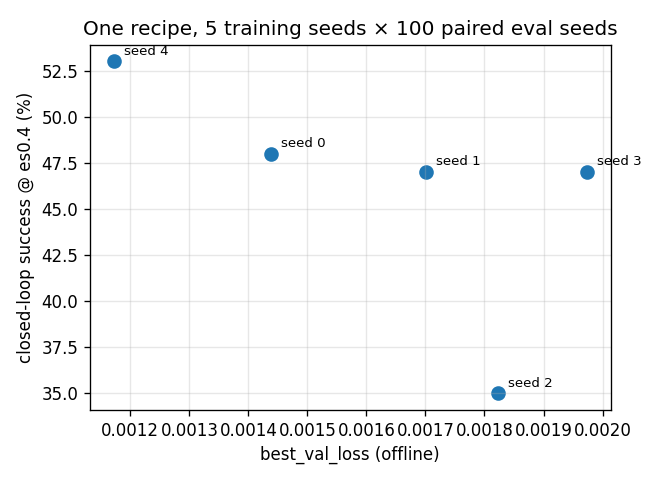

# KPI Dashboard — the M5→M7 experiment ledger

The consolidated record of every training and evaluation experiment behind the policy arc
(M5 first behavioral clone → M6 F/T residual → M7 vision + DAgger): what was tried, its
config, its measured result, and why it did or did not work. It exists because the numbers
that decide the project's story were scattered across `outputs/policy/runs/`, `runs/eval*/`,
and a private wiki, with no single document that reconciles them.

**Every number here is recomputed from the raw artifacts**, not copied from prose —
per-trial CSVs re-aggregated through `ai_teleop.eval.report`, training configs read from each
run's committed `metadata.json`. The reconstruction script and the exact paths are in
[§8](#8-provenance--how-to-regenerate). Where an artifact disagrees with the wiki, both values
are logged and the artifact wins.

> ## Read this first — the one hard constraint (LAB-114)
>
> On 2026-07-23 the LAB-114 investigation established that **training in this project was
> unseeded until that day**, and measured the consequence: a single fixed recipe, retrained
> across five seeds, spans an **18 pp** closed-loop success range (paired Δ from −15 to +3 pp)
> — [`../review/divergence-investigation.md`](../review/divergence-investigation.md) (and the
> private wiki concept `training-seed-variance`).
>
> That 18 pp is the **noise floor under every single-checkpoint number in this document.**
> Three rules follow, and this dashboard obeys them:
>
> 1. **Every closed-loop rate below carries its own `n`.** A margin smaller than ~18 pp *plus
>    the eval-sampling interval at that n* (±20 pp at n=20; ±10 pp at n=100) is a **draw, not a
>    finding** — flagged `NOISE` in the verdict column, never `WIN`/`REGRESSION`.
> 2. **The Phase-1 result is a distribution, never a standing +33 pp.** The 2026-07-07 headline
>    (36.7% → 70.0%) does not reproduce; its checkpoint and its training corpus are both gone
>    (provenance *unknown*, not disputed). See [§5](#5-the-phase-1-headline-as-a-distribution).
> 3. **The project's standing positive results are the bounded-force guarantee and the
>    mechanism findings** ([§7](#7-what-still-stands)) — *not* a success-rate lift, which on the
>    honest measurement is not established.
>
> One more, from finding H-11: **never compare an `expert_success_rate` to a residual success
> rate.** They are different actors, scored by different rules, at different difficulty — see
> the actor column in [§3](#3-training-runs-m5m7) and the note in [§2.3](#23-why-the-human-only-baseline-moves).

---

## 1. What the arc was trying to do

The policy is a **residual**: a human (here a scripted noisy operator) gives coarse 6-DoF
commands, and a behavioral-cloning-trained network adds a clamped micro-correction
(±2 cm / ±10° / ±5 N per step) on top of an always-on impedance backbone. The arc asked, in
order:

- **M5** — can a GRU clone the analytical expert's corrections at all? (offline BC)
- **M6** — does the F/T-only residual lift *closed-loop* insertion success over human-only?
- **M7** — does adding **vision** raise the success ceiling into the free-space regime, and can
  **DAgger** or a **better expert** push past the F/T ceiling?

M6 produced the one publishable positive (the Phase-1 headline). M7 is a documented negative,
and LAB-114 later showed the M6 positive rests on an unreproducible checkpoint. Both stories
are below with their numbers.

---

## 2. Operating-point ledger

Every closed-loop number is only interpretable against *which corpus trained the policy* and
*which difficulty the eval ran at*. These two tables are the key; the ledgers in §3–§4 point
back to them.

### 2.1 Corpus lineage (`data/dataset_*/metadata.json`)

| Corpus | Fingerprint | Created | n_ep | Schema | `expert_success_rate` | Role |
|---|---|---|---|---|---|---|
| `dataset_1` | `290f1750` | 2026-06-16 | 200 | 1.0 | — | M5 first BC (`lab34_baseline`). Old geometry/schema — **not comparable** to later corpora. |
| `dataset_9` | `54dccad9` | 2026-07-06 | 200 | 2.0 | 71.5% | The Phase-1 headline corpus. **Overwritten in place** — see caveat below. |
| `dataset_10` | `54dccad9` | 2026-07-22 | 200 | 2.0 | 71.5% | Regeneration of `dataset_9`'s config; trains every LAB-101/114 run. |
| `dataset_vision` | `de0eeb3b` | 2026-07-07 | 300 | 2.0 | 72.3% | All M6/M7 F/T + vision ablations (`ftonly_*`, `vision_*`). |
| `dagger_ft_agg` | `de0eeb3b` base | 2026-07-10 | 340→420 | 2.0 | — | Aggregated on-policy corpus, grows per DAgger round. |

**Two caveats the fingerprints hide:**

- **`dataset_9` and `dataset_10` share the fingerprint `54dccad9` but are not the same data**
  (finding G-4 / H-B). The fingerprint hashes *config*, not *code*; regenerating `dataset_9`'s
  config under 2026-07-22 code changed 35 of 200 trajectories (34 by a median of 1 step, one
  flipped baseline outcome, corpus baseline 22.5% → 23.0%). The original 2026-07-06 episode
  files were then **overwritten in place** by that regeneration — proven byte-for-byte by
  `scripts/dev/lab114_corpus_identity.py` — so `data/dataset_9/` now holds `dataset_10`'s
  arrays under `dataset_9`'s stale manifest. **The corpus that trained the headline no longer
  exists on disk.**
- **A "code era" column is load-bearing.** `dataset_0`/`dataset_1` (schema 1.0) already drift —
  their manifests predate `generated_walls` entering the fingerprint payload (finding C-1a).
  Do not trust byte-identical regeneration of any pre-LAB-91 corpus.

### 2.2 Eval operating points (`runs/eval*/trials.csv`)

| Eval set | `error_scale` | Seeds | Regime | `human_only` | Notes |
|---|---|---|---|---|---|
| `runs/eval/` (LAB-53) | 0.4 | 100 | in-band | **31.0%** | Older step-budget era (pre-LAB-100); zero force-aborts. |
| `eval_ftgate_es0p4` | 0.4 | 20 | in-band | 35.0% | M7 F/T gate ablation (3 arms). |
| `eval_ftgate_es1p0` | 1.0 | 20 | flat-wall | 15.0% | " |
| `eval_stageC_band04` | 0.4 | 20 | in-band | 35.0% | M7 Stage-C vision ablation (3 arms). |
| `eval_stageC` | 1.0 | 20 | flat-wall | 15.0% | " |
| `band_scale0.4` *(committed)* | 0.4 | 30 | in-band | **36.7%** | The 2026-07-07 headline slice. |
| `flatwall_scale1.0` *(committed)* | 1.0 | 30 | flat-wall | 20.0% | Headline's ceiling-check control. |
| `eval_lab101_band100*` | 0.4 | 100 | in-band | **50.0%** | LAB-101 reproduction (both ar0/ar100). |
| `eval_lab114_*` (×10) | 0.4 | 100 | in-band | **50.0%** | The seed-variance + H-B/H-C study. |

### 2.3 Why the `human_only` baseline moves

The three "contradictory" human baselines quoted across old docs — **36.7 / 31 / 50 / 35 / 15**
— are one number at different operating points, not a discrepancy:

- **50.0%** is the true in-band (es0.4) baseline, measured at 100 seeds, five independent times
  in LAB-114, all *exactly* 50.0% (the arm uses no checkpoint, so it is bit-stable).
- **36.7%** is that same baseline on the **hard 30-seed slice** (seeds 0–29) the headline
  happened to draw: 36.7% on 0–29 vs 55.7% on 30–99.
- **31.0%** is the LAB-53 run at an **older step-budget era** (pre-LAB-100) — a different
  contact regime, not a different sample.
- **35% / 15%** are the 20-seed es0.4 / es1.0 baselines (M7 sets); es1.0 lands on the flat wall
  where nobody has a lateral lever, so everyone drops.

The stale `outputs/policy/kpi_report/kpi_comparison.json` (human **15.0%**, vision residual
`"PENDING"`) is a fourth operating point *and* an un-refreshed artifact; Phase-3 stage 3C
retires it. The lesson: **a bare success rate is meaningless without its (corpus, error_scale,
seed-count, step-budget-era) tuple.**

---

## 3. Training runs (M5→M7)

Reconstructed from `outputs/policy/runs/<name>/metadata.json`. `val` is `best_val_loss` at
`best_epoch/epochs_run`. **All GPU, seed 0, unless noted.** Offline val loss is *within-recipe*
predictive but **anti-predictive across interventions** (LAB-106) — do not rank recipes by it.

| Run | Date | Corpus (fp) | Config delta vs F/T baseline | `val` (epoch) | Closed-loop | Verdict |
|---|---|---|---|---|---|---|
| `lab34_baseline` | 06-18 | `dataset_1` (`290f`) | M5 first BC, schema-1.0 task | 0.00042 (12) | — no committed eval | offline milestone |
| `ftonly_baseline_lab82` | 07-07 | `dataset_vision` (`de0e`) | F/T residual, no action-rate penalty | 0.00149 (17) | see §4 (es0.4 20s) | M6/M7 F/T baseline |
| `ftonly_ar30` | 07-08 | `dataset_vision` | + action-rate penalty ×30 | 0.00116 (28) | — | jerk-reduction sweep |
| `ftonly_ar100` | 07-08 | `dataset_vision` | + action-rate penalty ×100 | 0.00140 (23) | 40% (es0.4, 20s) | the "old-ar100" M7 arm |
| `ftonly_wpos10_wd` | 07-10 | `dataset_vision` | pos-loss ×10 + weight-decay | 0.00169 (17) | — | LAB-106 offline fix (1/2) |
| `ftonly_gate_wpos10_wd` | 07-10 | `dataset_vision` | ↑ + **`command_ee_delta`** feedback feature + gate | 0.00135 (26) | **10%** (es0.4, 20s) | **REGRESSION** — see §6 |
| `vision_frozen_lab82` | 07-07 | `dataset_vision` | + vision, frozen MobileNetV3 encoder | 0.00107 (26) | — | best offline val of the arc — see caveat |
| `vision_frozen_ar100` | 07-08 | `dataset_vision` | ↑ + action-rate ×100 | 0.00123 (19) | — | |
| `vision_stageC` | 07-10 | `dataset_vision` | vision, **encoder unfrozen** (Stage C) | 0.00161 (16) | 40% in / 10% out (20s) | **NULL** — see §6 |
| `dagger_round0` | 07-10 | `dagger_ft_agg` (340) | on-policy relabel, round 0 | 0.00209 (20) | 40% (es0.4, 20s) | DAgger start |
| `dagger_round1` | 07-10 | `dagger_ft_agg` (380) | round 1 | 0.00214 (9) | 30% | **REGRESSION** (§6) |
| `dagger_round2` | 07-10 | `dagger_ft_agg` (420) | round 2 | 0.00194 (13) | 15% | **REGRESSION** (§6) |
| `probe_b2` | 07-07 | `dataset_vision_probe` (10) | vision batch-2 smoke probe | 0.00702 (2) | — | fits-in-8GB probe only |
| `lab101_ft_ar0_ds10` | 07-22 | `dataset_10` (`54dc`) | headline recipe, GPU repro, ar0 | 0.00130 (22) | **−4.0 pp** (100s) | §5 |
| `lab101_ft_ar100_ds10` | 07-22 | `dataset_10` | ↑ + action-rate ×100 | 0.00178 (13) | **−9.0 pp** (100s) | §5 |
| `lab114_seed{0..4}` | 07-22 | `dataset_10` | headline recipe, seeds 0–4 (**seeded**) | 0.00117–0.00197 | −15…+3 pp | §5 the spread |
| `lab114_ds9_seed{0..3}` | 07-22 | `dataset_9` | H-B corpus arm — **identical to `_seed`** | ≡ `lab114_seed*` | ≡ | H-B unanswerable |
| `lab114_cpu_seed0` | 07-22 | `dataset_10` | H-C device arm, CPU | 0.00144 (21) | −1.0 pp (100s) | H-C null |

**The offline-val trap, stated once.** `vision_frozen_lab82` has the *best* val loss of the
whole arc (0.00107) and is a closed-loop non-improver; the headline recipe's own five seeds
span 18 pp of success at val losses 0.00117–0.00197. **A lower validation loss did not buy
closed-loop success across these interventions** — the central M7 mechanism (LAB-106,
[§7](#7-what-still-stands)).

---

## 4. Closed-loop experiment ledger

Reconstructed from the per-trial CSVs via `compare_paired`. Δ is paired (McNemar exact p);
`b/c` is discordant wins/losses. **Verdict uses the noise floor:** `NOISE` = |Δ| within
~18 pp training spread + the eval interval at that n.

| Eval set | Op. point | Arm | Success | Paired Δ (n, p) | Verdict |
|---|---|---|---|---|---|
| `band_scale0.4` | es0.4, 30s, `dataset_9` | residual | **70.0%** vs 36.7% | **+33.3 pp** (30, p=0.006) | **historical, unreproducible** — §5 |
| `flatwall_scale1.0` | es1.0, 30s | residual | 20.0% vs 20.0% | +0.0 pp (30, p=1.0) | flat-wall ceiling control (expected) |
| `runs/eval/` (LAB-53) | es0.4, 100s, old budget | residual | 43.0% vs 31.0% | +12.0 pp (100, p=0.043) | **NOISE** — inside 18 pp; a re-run, not a first measurement (H-7) |
| `eval_ftgate_es0p4` | es0.4, 20s | ar100 (`residual`) | 40.0% vs 35.0% | +5.0 pp (20, p=1.0) | **NOISE** |
| `eval_ftgate_es0p4` | es0.4, 20s | `command_ee_delta` (`ftonly`) | **10.0%** vs 35.0% | −25.0 pp (20, p=0.125) | **REGRESSION** (mechanism, §6) |
| `eval_ftgate_es1p0` | es1.0, 20s | ar100 / gate | 20% / 15% vs 15% | ≤+5 pp (20, p=1.0) | **NOISE** (flat wall) |
| `eval_stageC_band04` | es0.4, 20s | ftonly / **vision** | 40% / **40%** vs 35% | +5 / +5 pp (20, p=1.0) | **NULL** — vision ties F/T (§6) |
| `eval_stageC` | es1.0, 20s | ftonly / **vision** | 20% / **10%** vs 15% | +5 / −5 pp (20, p=1.0) | **NOISE** (margin < floor) |
| `eval_lab101_band100_ar0` | es0.4, 100s, `dataset_10` | residual | 46.0% vs 50.0% | **−4.0 pp** (100, p=0.557) | reproduction — §5 |
| `eval_lab101_band100` | es0.4, 100s, `dataset_10` | residual (ar100) | 41.0% vs 50.0% | **−9.0 pp** (100, p=0.136) | reproduction — §5 |
| `eval_lab114_seed2` | es0.4, 100s | residual | 35.0% vs 50.0% | **−15.0 pp** (100, **p=0.008**) | a *significant* regression from nothing but a seed — §5 |
| `eval_lab114_seed4` | es0.4, 100s | residual | 53.0% vs 50.0% | +3.0 pp (100, p=0.74) | the other end of the same spread |

The Stage-C DAgger rounds (`eval` per round, 20s es0.4) read **40% → 30% → 15%** across rounds
0–2 — the round-to-round steps are inside the noise floor, but the round-0-to-round-3 drop and
the parallel rollout-success decline (0.325 → 0.25) are the real signal (§6).

---

## 5. The Phase-1 headline, as a distribution

The M6 result was published (2026-07-07) as **human 36.7% → residual 70.0%, +33.3 pp**
(McNemar p=0.006, 30 seeds, es0.4). It is kept in the ledger as a historical point because its
records are committed — **not because it stands.**

**It does not reproduce.** Two GPU retrains of the same recipe on `dataset_10`, each at 100
paired seeds:

| Run | `human_only` | `residual` | Paired Δ | p | jerk (h→r) |
|---|---|---|---|---|---|
| published 07-07 (CPU, `dataset_9`, ep22) | 36.7% | **70.0%** | **+33.3 pp** | 0.006 | 31.1 → 149.1 |
| `lab101_ft_ar0_ds10` (GPU, ep22) | 50.0% | 46.0% | **−4.0 pp** | 0.557 | 45.6 → 153.6 |
| `lab101_ft_ar100_ds10` (GPU, ep13) | 50.0% | 41.0% | **−9.0 pp** | 0.136 | 45.6 → **85.7** |

**The environment is exonerated:** `human_only` uses no checkpoint and scores 36.7%
*seed-for-seed* on all three runs' shared 30 seeds. The only variable is the checkpoint. And
the checkpoint was an unseeded, unrepeatable draw (root cause H-10, fixed in LAB-114).

**The recipe's true behavior is the spread**, measured five seeded ways
(`docs/results/phase-1/lab114/`):

| train seed | `val` | residual | paired Δ | on the 30 headline seeds |
|---|---|---|---|---|
| 0 | 0.00144 | 48.0% | −2.0 pp | 53.3% |
| 1 | 0.00170 | 47.0% | −3.0 pp | 46.7% |
| 2 | 0.00182 | **35.0%** | **−15.0 pp** (p=0.008) | 26.7% |
| 3 | 0.00197 | 47.0% | −3.0 pp | 46.7% |
| 4 | 0.00117 | 53.0% | +3.0 pp | 53.3% |
| **mean** | | **46.0%** | **−4.0 pp** | span 26.7–53.3% |

**Mean −4 pp, range [−15, +3], spread 18 pp.** The headline's 70.0% sits **16.7 pp above the
best of these five** on its own scenarios — so seed variance (H-A) explains why *no
single-checkpoint claim is safe* but does **not** reach the headline. The other two suspects
were tested: **corpus drift (H-B) is unanswerable** (the 2026-07-06 corpus was overwritten;
today's drift is 1 flipped outcome in 200) and **device (H-C) is null** (CPU vs GPU is
‖Δw‖/‖w‖ = 5e-04, one eval seed of 100). Two of the three artifacts behind the headline — its
checkpoint (H-8, `outputs/` gitignored) and its corpus (H-B) — no longer exist. **Its
provenance is unknown, not disputed.**

Free result worth keeping: across those five seeds, `best_val_loss` vs closed-loop success is
Spearman **ρ = −0.82** (p=0.089, n=5) — offline loss is directionally predictive *within one
recipe*, the opposite of its across-intervention behavior. Selecting the best-val checkpoint of
a fixed recipe is therefore not actively harmful; tuning *recipes* by val loss is.




---

## 6. Negative results

Surfacing the failures is an explicit goal of this document — each is a mechanism, not just a
missing win.

- **Action-rate penalty — works exactly as designed, and it is *not* the headline's problem.**
  `ar0` vs `ar100` on `dataset_10` are indistinguishable on success (46% vs 41%, inside the
  floor) but jerk drops **153.6 → 85.7** (p<1e-15). The penalty buys smoothness at no success
  cost — which *retires* the D-6 "apply the action-rate penalty to the headline run" candidate:
  it was already applied and does nothing to success.
- **The offline-fix collapse (`command_ee_delta`) — REGRESSION, and the sharpest mechanism.**
  Adding a `(command − ee_position)` **feedback feature** + pos-loss ×10 drove offline error
  below the zero-Δ baseline for the first time (7.6 → 3.5 mm) — and closed-loop success
  **collapsed to 10%** (`ftonly_gate_wpos10_wd`, es0.4, vs 35% human), with *more* force-aborts.
  Online, the policy amplifies its own tracking error into wall-slams. **A more accurate
  imitator is a worse controller** — offline BC fidelity is *anti*-correlated with closed-loop
  success on this task (LAB-106).
- **DAgger degrades, it doesn't rescue — REGRESSION.** Three F/T rounds on the ar100 base:
  **40% → 30% → 15%** (rollout success 0.325 → 0.25). Mechanism: the policy's rollouts are
  dominated by force-abort states, and the **bounded analytical expert cannot demonstrate a
  recovery** from a peg pinned at the force cap — so each round aggregates more failure states
  labeled with passive Δ, and the clone gets more passive. DAgger's founding premise (a
  competent expert on visited states) is structurally violated.
- **Stage-C vision fine-tune — NULL.** Unfreezing the image encoder (`vision_stageC`) ties
  F/T-only in-band (40% vs 40%, es0.4) and loses out-of-band (10% vs 20%, es1.0, inside the
  floor). Vision carries little marginal signal because **the operator command already proxies
  the hole location** (LAB-77 identifiability); the free-space correction the clone would learn
  is ≈0 by construction.
- **A better analytical expert — REFUTED (LAB-108).** Five expert knobs meant to prevent the
  slam were all inert; the expert's own ceiling stayed at ~73.3%. The binding constraint is
  operator-originated, pre-contact force-abort, which a bounded residual cannot fix.

---

## 7. What still stands

Two classes of result do **not** rest on a sampled success rate, so LAB-114 leaves them intact.
These are the project's standing positives.

- **The bounded-force guarantee.** The residual is hard-clamped (±5 N/step) and the impedance
  backbone bounds contact force mechanically, so even a 100%-wrong network output cannot exceed
  the envelope. Peak contact force was **never exceeded across any trial in any eval set** —
  this is a property of the controller, proven by construction, not an estimated rate.
- **The mechanism findings**, each theory or a byte-identical/exact probe:
  - **Identifiability ceiling** (LAB-77) — the operator command proxies the hole; a no-vision
    residual cannot lift success outside the chamfer band. A structurally-flat flat-wall delta
    is a *result*, not a failure.
  - **Far-field gating failure** (LAB-106) — trained GRUs emit a ~5.6 mm correction floor
    across the ~60% free-space steps where the expert is exactly zero.
  - **Offline/closed-loop anti-correlation** (LAB-106) — fixing offline BC error made
    closed-loop worse; only a closed-loop ablation is a valid signal here.
  - **The bounded-expert/DAgger argument** (LAB-105/106) — on-policy relabeling can only teach
    what the expert can perform, and it cannot un-jam a force-aborted peg.

An honest engineering summary: **Phase 1 delivers a provably safe assist and a mechanized
account of why per-step imitation cannot lift closed-loop seating success on this task. The
success-rate *lift* is, on the seeded measurement, not established.**

---

## 8. Provenance & how to regenerate

Every table above is a pure function of committed artifacts. Re-aggregate any eval set:

```bash
# One eval set → success + paired McNemar + per-KPI Wilcoxon, from raw per-trial rows.
uv run python scripts/report_results.py --trials runs/eval_lab101_band100_ar0/trials.csv

# The committed Phase-1 records (headline, flat-wall, seed-variance, H-C) live here:
ls docs/results/phase-1/*.csv docs/results/phase-1/lab114/
```

Training configs are each run's committed `outputs/policy/runs/<name>/metadata.json`. Post-G1
runs carry a `checkpoint_sha256`; the two pre-G1 checkpoints behind published numbers are
committed under `docs/results/phase-1/checkpoints/` (retention policy: that dir's README).

**Three provenance gaps this ledger inherits, stated so no reader trusts a number past them:**

| Gap | Finding | Consequence |
|---|---|---|
| The 2026-07-07 headline **checkpoint** is gone | H-8 (`outputs/` gitignored) | 70.0% cannot be re-evaluated. |
| The headline **corpus** was overwritten in place | H-B / G-4 | `dataset_9`'s trajectories are unrecoverable. |
| `dataset_0`/`dataset_1` fingerprints predate `generated_walls` | C-1a | Pre-LAB-91 corpora do not regenerate byte-identically. |

The reconstruction that built §3–§4 is a read-only sweep over `outputs/policy/runs/`,
`runs/eval*/`, and `data/dataset_*/` — see the LAB-114 evidence scripts
(`scripts/dev/lab114_corpus_identity.py`, `lab114_weight_distance.py`) and the report audit
(`scripts/dev/lab42_report_audit.py`).

---

**See also:** [`phase-1-results.md`](../phase-1-results.md) (the headline record, kept
verbatim) · [`review/divergence-investigation.md`](../review/divergence-investigation.md) (the
full LAB-114 investigation) · [`architecture-tour.md`](../architecture-tour.md) (where each of
these modules lives).
