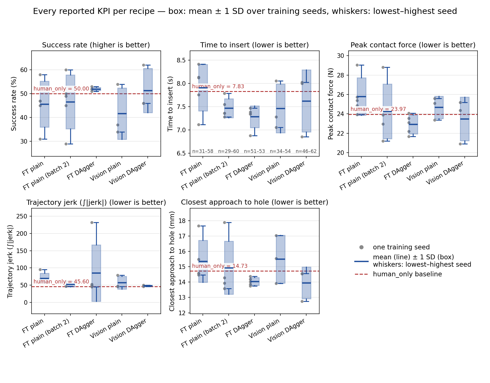
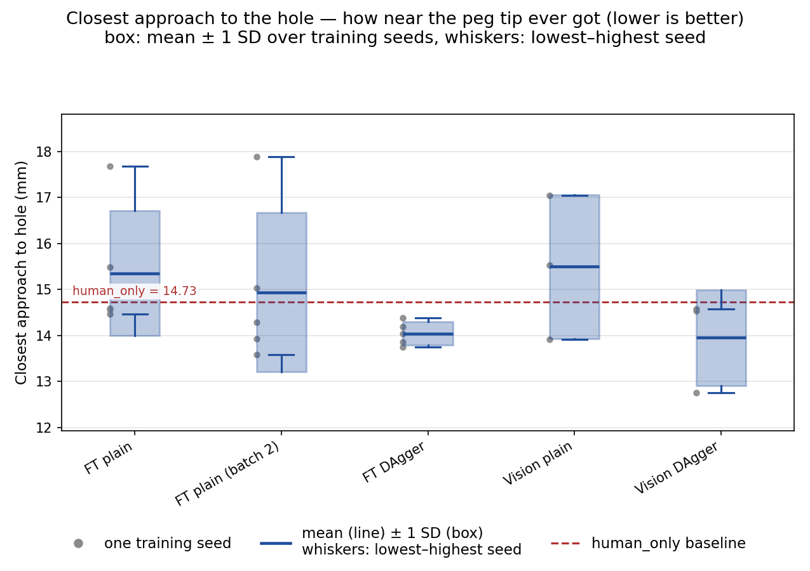

# Results — the M5→M7 experiment record

The consolidated record of every training and evaluation experiment behind the policy arc
(M5 first behavioral clone → M6 F/T residual → M7 vision + DAgger). It exists because the
numbers that decide the project's story were scattered across `outputs/policy/runs/`,
`runs/eval*/` and a private wiki, with no single document that reconciles them.

**This page is the index.** Each file below answers a *different* question — what retraining
moves, what one checkpoint does trial by trial, why none of it lifts seating, and what was
run on what data. Start with whichever question you have.

**Every number is recomputed from the raw artifacts**, not copied from prose — per-trial CSVs
re-aggregated through `ai_teleop.eval.report`, training configs read from each run's committed
`metadata.json`. Where an artifact disagrees with the wiki, both values are logged and the
artifact wins.

---

## What the arc asked, and the one-line answer

The policy is a **residual**: a human (here a scripted noisy operator) gives coarse 6-DoF
commands, and a behavioral-cloning-trained network adds a clamped micro-correction
(±3 cm / ±10° / ±5 N per step) on top of an always-on impedance backbone. The arc asked, in
order:

- **M5** — can a GRU clone the analytical expert's corrections at all? (offline BC)
- **M6** — does the F/T-only residual lift *closed-loop* insertion success over human-only?
- **M7** — does adding **vision** raise the ceiling, and can **DAgger** or a **better expert**
  push past the F/T ceiling?

**The answer to both closed-loop questions is no.** On the seeded multi-seed measurement the
four production recipes measure **−4.4, +2.0, −8.3 and +1.3 pp** against a training-seed noise
floor of **20–31 pp**. What the arc contributes instead is a bound on the assist's authority, a
measured reduction in contact force and force-aborts under DAgger, and a mechanism-level account
of *why* per-step imitation cannot lift seating on this task.

---

## 1. [The noise floor](noise-floor.md) — what retraining alone moves

*The between-seed question.* Train one recipe several times changing only the training seed:
how far apart do the outcomes land? Further apart than any treatment effect measured here.
That spread is the resolution every other number must clear, and it is why nothing in these
files is reported as a single checkpoint.

[](noise-floor.md)

Also there: the **official multi-seed run** — all production recipes retrained across seeds on
100 paired held-out eval walls. The measurement the headline rests on.

## 2. [The KPI board](kpi-board.md) — every recipe, every metric

Success is one KPI of several. All of them per recipe as seed-level distributions: the full
board, the same metrics restricted to trials that actually seated, plain BC versus DAgger side
by side, and DAgger across its rounds.

[](kpi-board.md)

The short version: **DAgger buys reliability and a couple of newtons, not seating.**

## 3. [Within a single seed](within-seed.md) — the policy against the operator, trial by trial

*The within-seed question, and a different one.* Hold the checkpoint fixed and look at
individual trials: how does this one policy compare to the human, wall by wall? The answer is
invisible in any mean — peak contact force is **bimodal**, so its average falls in the trough
between the two modes and describes no trial that ran. Every KPI then gets both views per
training seed: the absolute distributions, and the deltas paired **on the same wall**.

[](within-seed.md)

The short version: **a near-zero Δ is not an inert policy** — every checkpoint flips the
outcome on 20–37 walls of 100, in both directions at once.

## 4. [Near-miss](near-miss.md) — did it *almost* insert?

Every KPI above is either conditioned on seating or indifferent to it, so none can tell a
policy that almost inserts from one that flails. This measures the closest the peg tip ever
came to the hole, on all 4,200 official trials, recovered from the stored traces without
re-running an episode.

[](near-miss.md)

The short version: **no — and that is the point.** No recipe moves closest approach by more
than 0.8 mm on a 14.7 mm baseline, closing off the "better than the success rate says"
explanation for the flat headline. Restricted to the walls the assist never flipped, nothing
clears its noise floor at all. The per-outcome table looks like a large win and is Simpson's
paradox; the page shows the arithmetic four ways.

## 5. [Mechanisms](mechanisms.md) — why it does not work, and what stands

The negative results with their explanations — the identifiability ceiling, the far-field
gating floor, the offline/closed-loop anti-correlation, the bounded-expert argument — and the
claims that survive them. Also the precise statement of what the architecture does and does
**not** guarantee about contact force.

## 6. [Experiment ledger](experiment-ledger.md) — what was run, on what data

Which corpus trained which policy, which difficulty each eval ran at, what each run measured.
Not a conclusion: the key that makes everything above interpretable, because a closed-loop
number means nothing without its operating point.

## 7. [Further exploration](further-exploration.md) — what was tried, what might still work

Every lever tried and what it measured, then the candidates the mechanism findings predict
could still move the number. Contact-recovery control is the strongest of them.

## 8. [Human-operator trial](human-trial-protocol.md) — the protocol, fixed in advance

Every number above was measured against `ScriptedNoisyHuman`, a *model* of an operator. This
is the protocol for the one measurement where a real one closes the loop: blinded,
block-randomized, and pre-registered — including the statement that at 30 trials per arm it
can only resolve differences of ~33 pp, so it is a proxy-validity check rather than a re-run
of the effect measurement. **Pre-registered, not yet run.**

---

> ## The one hard constraint, stated once
>
> **Training was unseeded before 2026-07-23** — `torch.manual_seed` was absent and `--seed`
> reached only the train/val split, so weight init and batch order came from OS entropy while
> each run folder recorded a seed and a git commit. It is seeded now, with a
> train-twice-identical-weights test. Every pre-2026-07-23 number in these files is one
> unrepeatable draw, listed as **history, not evidence**.
>
> Three rules follow, and every file obeys them:
>
> 1. **A single checkpoint is not a measurement.** Every closed-loop claim is a distribution
>    over ≥3 training seeds, each carrying its `n`.
> 2. **A p-value inside one checkpoint pair says nothing about the recipe.** F/T seed 1 reads
>    −19 pp at **p=0.0009** and vision-DAgger seed 1 reads +12 pp at **p=0.036** — significant
>    results pointing in *opposite* directions inside the same recipe families.
> 3. **Never compare an `expert_success_rate` to a residual success rate.** Different actors,
>    different scoring rules, different difficulty (finding H-11).

---

## 9. Provenance & how to regenerate

Every table above is a pure function of committed artifacts. Re-aggregate any eval set:

```bash
# One eval set → success + paired McNemar + per-KPI Wilcoxon, from raw per-trial rows.
uv run python scripts/report_results.py --trials runs/eval_lab101_band100_ar0/trials.csv

# The committed Phase-1 records (30-seed slice, flat-wall, seed-variance, H-C) live here:
ls docs/results/phase-1/*.csv docs/results/phase-1/lab114/

# The official multi-seed success distributions (noise-floor.md §5.5), all recipes over seeds:
uv run python scripts/dev/official_kpi/aggregate.py       # reads runs/eval_official_*

# The full KPI board (kpi-board.md §5.6) — every recipe x every metric, as markdown on stdout:
uv run python scripts/dev/official_kpi/kpi_tables.py      # → docs/results/phase-1/official_kpi_tables.md

# Figures 1–5 — the same statistics as plain matplotlib box charts:
uv run python scripts/dev/official_kpi/plot_kpis.py       # → docs/results/phase-1/*.png

# Figures 6/6b/6c — per-trial distributions by arm and outcome, seeds pooled (one per KPI):
uv run python scripts/dev/official_kpi/plot_trial_forces.py

# Figures 7–13 — per-training-seed trial distributions and paired per-wall deltas:
uv run python scripts/dev/official_kpi/plot_within_seed.py   # → phase-1/within_seed_*.png

# Near-miss (near-miss.md §4) — closest approach, paired + by outcome + mix-standardized:
uv run python scripts/dev/official_kpi/near_miss.py
```

The near-miss columns are recovered from the stored per-tick traces rather than re-run. If a
`trials.csv` predates LAB-121 it simply lacks them (every reader tolerates their absence);
`backfill_near_miss.py` replays the traces to add them, and refuses to write any run whose
replay does not first reproduce that run's already-stored KPI columns exactly:

```bash
uv run python scripts/dev/official_kpi/backfill_near_miss.py --glob 'eval_official_*'          # gate only
uv run python scripts/dev/official_kpi/backfill_near_miss.py --glob 'eval_official_*' --write  # then write
```

Every one of these reads the eval CSVs through `ai_teleop.eval.report` (`load_trials` →
`group_by_config` → `summarize_config` / `compare_paired`) and re-derives no statistic of its
own; `scripts/dev/official_kpi/kpi_data.py` is the shared loader. Each takes `--runs-root` (and
`kpi_tables.py` / `plot_kpis.py` also `--policy-runs-root`) if the eval sets live elsewhere.
`aggregate.py` takes no arguments.

**The raw per-trial data is committed.** All 25 official eval sets — the 21 `eval_official_*`
runs behind every number on these pages, plus the 4 `backfill_dag_vis_s0_r*` rounds — are in
[`phase-1/official-evals/`](phase-1/official-evals/), one CSV per run, 4200 trials in ~500 KB.
Point any script at them with `--runs-root`, or re-aggregate one directly:

```bash
uv run python scripts/report_results.py --trials docs/results/phase-1/official-evals/eval_official_ft_s0.csv
```

so every published figure is checkable from a clean clone rather than only on the machine that
produced it. The chunk scripts that ran the evals are `scripts/dev/official_kpi/*.sh`
(self-resumable, self-timing); per-round DAgger `trials.csv` under
`outputs/policy/runs/dag_*_s*/dagger_round*/` remain local artifacts.

Training configs are each run's committed `outputs/policy/runs/<name>/metadata.json`. Post-G1
runs carry a `checkpoint_sha256`; the two pre-G1 checkpoints behind published numbers are
committed under [`docs/results/checkpoints/`](checkpoints/) (retention policy: that dir's README).

**Three provenance gaps this ledger inherits, stated so no reader trusts a number past them:**

| Gap | Finding | Consequence |
|---|---|---|
| The 2026-07-07 M6 **checkpoint** is gone | H-8 (`outputs/` gitignored) | 70.0% cannot be re-evaluated. |
| That run's **corpus** was overwritten in place | H-B / G-4 | `dataset_9`'s trajectories are unrecoverable. |
| `dataset_0`/`dataset_1` fingerprints predate `generated_walls` | C-1a | Pre-LAB-91 corpora do not regenerate byte-identically. |
| The 2026-07-07 M6 **eval sets** (`band_scale0.4`, `flatwall_scale1.0`) were never committed | — | Their rows in the ledger cannot be re-derived; `scripts/dev/lab114_seed_spread.py` needs them and will not run without them. The official-run numbers, which the results rest on, are unaffected — those CSVs are committed. |

The reconstruction that built §3–§4 is a read-only sweep over `outputs/policy/runs/`,
`runs/eval*/`, and `data/dataset_*/` — see the LAB-114 evidence scripts
(`scripts/dev/lab114_corpus_identity.py`, `lab114_weight_distance.py`) and the report audit
(`scripts/dev/lab42_report_audit.py`).

---

**See also:** [`architecture-tour.md`](../guides/architecture-tour.md) (where each of
these modules lives).
